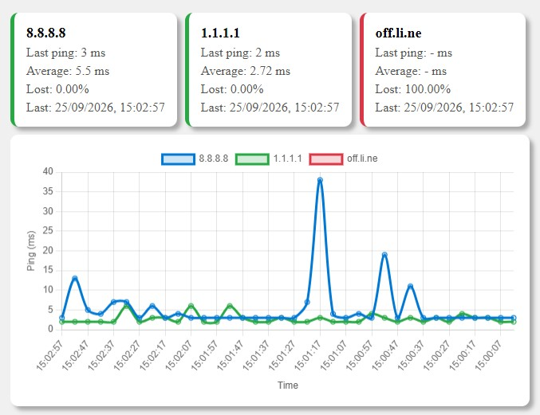

# Ping Tool API

Simple REST API for **monitoring the availability and latency of multiple hosts** with Node.js. The service runs pings at configurable intervals, keeps recent history for each host, and exposes the results as JSON.

Use this project for local network monitoring, server checks, health checks, connectivity diagnostics, or as a backend for a latency dashboard.

<div align="center">

### ⭐ Like **ping-tool-api**? [Star it on GitHub](https://github.com/Mssjim/ping-tool-api) to support the project!  

</div>


## Dashboard usage example


## Features

- Continuous monitoring of multiple hosts, IP addresses, or domains.
- Configurable interval and timeout for each host.
- Last latency measurement in milliseconds (`last_ping`).
- Average of successful responses (`avg`).
- Failure percentage within the history (`loss`).
- Limited history to prevent unbounded memory growth.
- JSON API compatible with any frontend or observability tool.
- CORS enabled for use by web applications.

## Requirements

- Node.js 14 or later.

## Installation

Clone this repository from GitHub and install the dependencies:

```bash
git clone https://github.com/Mssjim/ping-tool-api.git
cd ping-tool-api
npm install
```

## Configuration

Edit the `settings.json` file in the project root.
- `delay` is specified in seconds.
- `timeout` is specified in milliseconds.

```json
{
	"port": 3000,
	"historyLimit": 120,
	"hosts": [
		{
			"host": "8.8.8.8",
			"timeout": 3000,
			"delay": 5
		},
		{
			"host": "example.com",
			"timeout": 3000,
			"delay": 10
		}
	]
}
```

| Field | Type | Description |
| --- | --- | --- |
| `port` | number | HTTP API port. The default is `3000`. |
| `historyLimit` | number | Maximum number of measurements kept for each host. |
| `hosts` | array | List of monitored hosts. |
| `hosts[].host` | string | IP address or domain to test. |
| `hosts[].timeout` | number | Maximum response wait time, in milliseconds. |
| `hosts[].delay` | number | Interval between measurements, in seconds. |

## Usage

Start the API:

```bash
npm start
```

For development with automatic reloading:

```bash
npm run dev
```

With the example configuration, the API will be available at `http://localhost:3000`.

## Endpoint

### `GET /`

Returns the state and history of the configured hosts:

```bash
curl http://localhost:3000/
```

Example response:

```json
[
	{
		"host": "8.8.8.8",
		"last_ping": 18,
		"last_checked": "2024-01-01T12:00:00.000Z",
		"history": [
			{
				"ts": "2024-01-01T12:00:00.000Z",
				"ping": 18
			},
			{
				"ts": "2024-01-01T11:59:55.000Z",
				"ping": 20
			}
		],
		"avg": 19,
		"loss": 0
	}
]

```

> When a host does not respond, `last_ping` and `avg` may be `null`, and the corresponding history entry will have `ping: null`.

## Dashboard

The [`dashboard.html`](dashboard.html) file contains an example dashboard for viewing API results and testing the service in a browser.

To test it:

1. Start the API with `npm start`.
2. Open [`dashboard.html`](dashboard.html) in your browser.
3. Make sure the API URL used by the dashboard matches the port configured in `settings.json`.

## FAQ

[](https://github.com/Mssjim/ping-tool-api#faq)

**Q: How do I add a new host to the monitoring list?**

> A: Add an object with `host`, `timeout`, and `delay` to the `hosts` list in `settings.json`, then restart the application.

**Q: What do `avg` and `loss` mean in the API response?**

> A: `avg` is the average latency of successful responses in the host history, measured in milliseconds. `loss` is the percentage of measurements without a response within the stored history.

**Q: The host appears with `last_ping: null`. What should I check?**

> A: Check whether the host is reachable, the `ping` command works on your operating system, and the firewall or network is not blocking ICMP.

**Q: How do I change the API port?**

> A: Change the `port` field in `settings.json`, restart the application, and use the new port in the dashboard or HTTP requests.

### More questions? Feel free to open an issue.

[](https://github.com/Mssjim/ping-tool-api#more-questions-feel-free-to-open-an-issue)

## Contributing - Bug Fixes

[](https://github.com/Mssjim/ping-tool-api#contributing---bug-fixes)

Contributions are welcome! Open an issue or submit a pull request for bug fixes, API improvements, dashboard improvements, or new features.

1. Fork the repository.
2. Create a new branch: `git checkout -b <new-feature-name>`.
3. Make your changes.
4. Commit your changes: `git commit -am "Add new feature"`.
5. Push the branch: `git push origin <new-feature-name>`.
6. Open a pull request on GitHub.

Many thanks!
